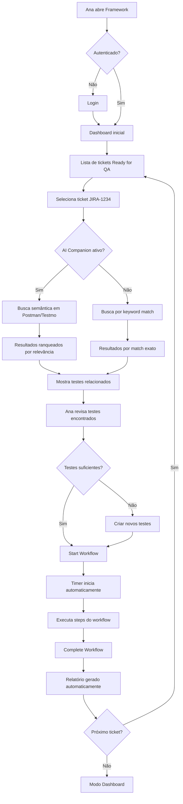
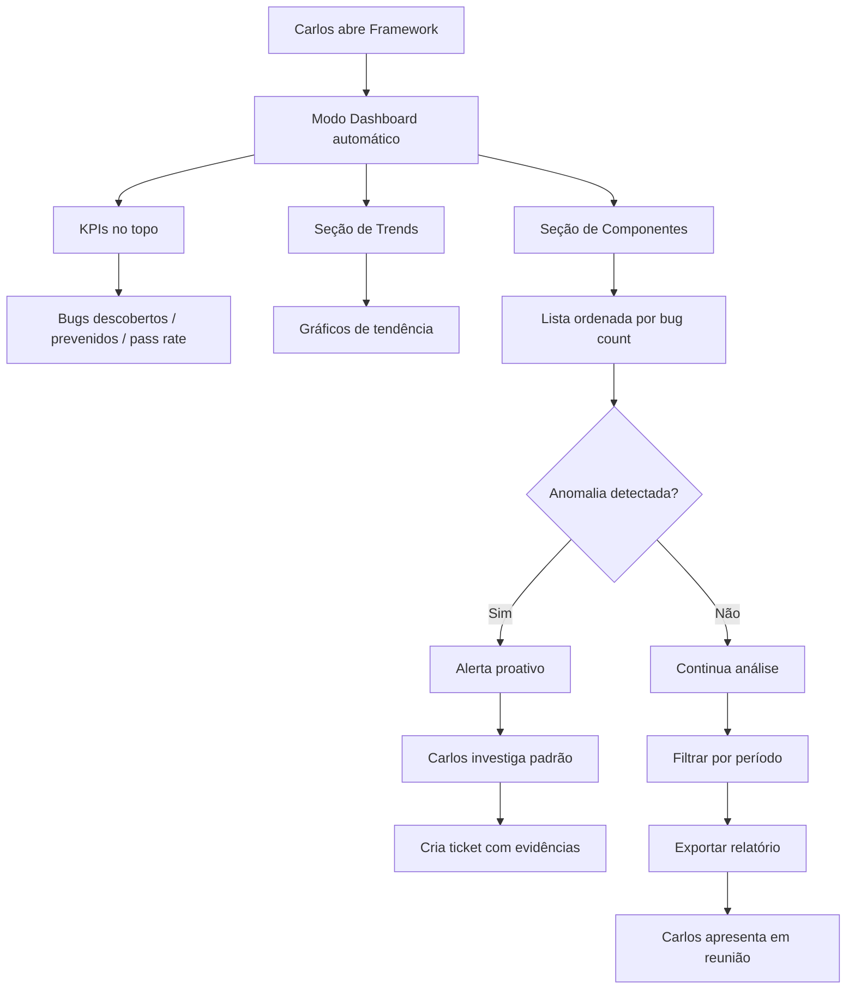
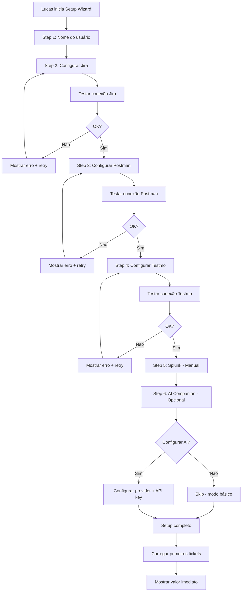
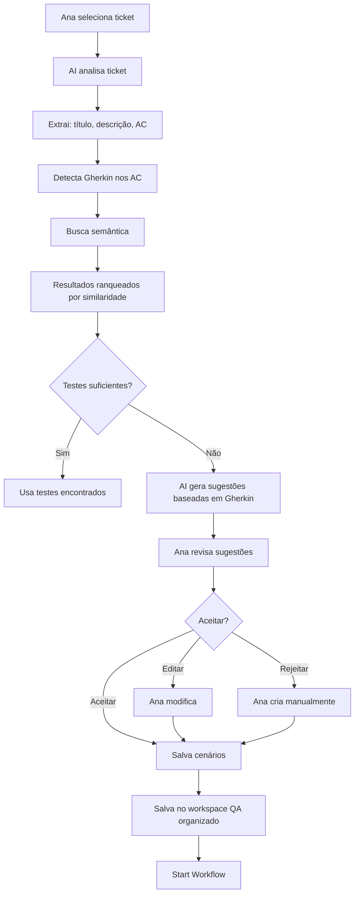

# UX Design Specification estrategia preventiva-reativa

**Author:** Daniel
**Date:** 2026-01-02

---

## Executive Summary

### Project Vision

QA Intelligent PMS é um **Companion Framework** para QAs em empresas de Property Management Software que resolve fragmentação de ferramentas (Jira, Postman, Testmo, Splunk, Grafana) através de integração inteligente, medição concreta de tempo e qualidade, e workflows guiados.

**Diferenciação:** Não substitui QAs ou ferramentas - integra e potencializa. Implementado em Rust (99% dos casos, Python apenas onde impossível substituir) com foco em performance, segurança e escalabilidade até 7 usuários simultâneos.

**Abordagem Técnica:**
- Rust-first para novas features (mais eficiente, seguro e rápido)
- Python legado mantido apenas onde não há como substituir
- Backend: Rust com async/await (tokio) para performance
- Frontend: Web interface otimizada para Rust backend
- Integrações: Módulos separados por ferramenta

### Target Users

**Ana (QA Principal) + 6 QAs:**

- **Trabalho:** Remoto, maioria com monitor único, alguns com duplo
- **Carga variável:** 3-5 tickets/dia simples vs tickets complexos que levam dias
- **Pain principal:** Context switching constante entre 5 ferramentas (Jira, Postman, Testmo, Splunk, Grafana), tickets sem documentação adequada, estimativa impossível
- **Preferências:** 100% UI sobre terminal (alguns QAs técnicos usam terminal, mas precisam verificar documentação)
- **Ferramentas:** VS Code, Cursor, Testmo, Postman
- **Tipo de testes:** Testes de API (possível automação) + testes manuais na UI (funcional, exploratório, performance, etc.)
- **Aceitação:** Testes são norteados por **Acceptance Criteria em Gherkin style** (a maioria, facilita, mas não todos)
- **Busca:** Workflow assistido que reduza interrupções, documentação automática, time tracking real

**Carlos (PM) + Juliana (PO):**

- **Uso de dashboards:** Reuniões e desk (não mobile ainda)
- **Situação atual:** NÃO têm dashboard hoje - usam Jira, Google Sheets, CSV, Google Docs, Drive de forma rudimentar
- **Necessidades:** Relatórios focados em observabilidade, ROI, melhoria/degradação, bugs prevenidos
- **Framework como insight:** Usam para enxergar e insights, mas ferramenta principal é para QAs
- **Exportação:** A cada 2 sprints
- **Contexto real:** Guardam logs (Splunk, Grafana) mas muito mal organizado, rudimentar

**Lucas (DevOps/Setup):**

- **Implementa framework na empresa**
- **Configura integrações (Jira, Postman, Testmo, Splunk, Grafana)**
- **Setup wizard guiado** com validação

**Sofia (Support/Troubleshooting):**

- **Resolve problemas de QAs rapidamente**
- **Portal com dashboard de tickets ativos**
- **Diagnósticos automáticos e knowledge base**

**Equipe:** 7 QAs totais, máximo 7 simultâneos no framework, crescimento lento (1 novo QA a cada 6 meses)

### Key Design Challenges

**1. Integração Visual Harmoniosa com Hostfully:**

- **Contexto:** Hostfully usa paleta azul e verde (profissionalismo, confiabilidade, crescimento)
- **Problema:** Art Deco atual não funciona visualmente quando misturado com PMS
- **Desafio:** Criar design system que se integre harmoniosamente sem parecer "produto separado"

**2. Context Switching Redução:**

- **Contexto:** QAs sofrem interrupções constantes (Jira, Postman, Testmo, Splunk, Grafana)
- **Desafio:** Framework deve ser "single pane of glass" que reduz necessidade de context switching
- **Nota:** QAs ainda podem querer acessar Confluence/Jira/Grafana separadamente, mas a ideia principal é integrar o máximo possível

**3. Balanceamento: Profundidade vs Simplicidade:**

- **Contexto:** Framework faz muito (workflows, time tracking, métricas, relatórios, dashboards)
- **Desafio:** Interface intuitiva para não-técnicos mas poderosa para técnicos
- **Princípio:** Primeiro ser user-friendly, atalhos podem vir depois

**4. Estimação Impossível:**

- **Contexto:** QAs não conseguem estimar tempo de antemão
- **Variabilidade:** Tickets variam de simples (horas) a complexos (dias)
- **Desafio:** Framework deve capturar tempo real vs "estimativa baseada em históricos"

**5. Escalabilidade Controlada:**

- **Contexto:** Máximo 7 usuários simultâneos, crescimento lento (startup que estabiliza)
- **Necessidade:** Framework preparado para features adicionais mas não precisa de arquitetura massiva
- **Desafio:** Design system escalável sem over-engineering

### Design Opportunities

**1. Novo Design System Baseado em Hostfully:**

- **Paleta de Cores:**
  - **Primário:** Azul (#0EA5E9 - Hostfully blue)
  - **Secundário:** Verde (#28C76F - Hostfully green)
  - **Acentos:** Gold/Amber para ações importantes
  - **Neutros:** Grays modernos para backgrounds e textos
- **Estilo:** Profissional, limpo, harmonioso com PMS
- **Componentização:** Tokens de design, componentes reutilizáveis para escalabilidade
- **Dark Mode:** Apenas light mode por enquanto (futuro pode expandir)
- **Referência:** Aproveitar padrões visuais da Hostfully para consistência

**2. Workflow Assistido Inteligente:**

- **Conceito:** Framework "acompanha" QAs - ser proativo em assistência
- **Oportunidades:**
  - Sugestões contextuais de testes baseados em ticket Jira
  - Notificações de anomalias em tempo real (alertas de degradação)
  - Guardar passos automaticamente para redução de context switching
  - Documentação automática de estratégias usadas
  - Checklists de verificação que garantem melhores práticas

**3. Relatórios Focados em Observabilidade:**

- **Para PM/PO:** ROI, melhoria/degradação, bugs prevenidos
- **Situação atual:** PMs/POs NÃO têm dashboards consolidados hoje - usam ferramentas rudimentares (Jira, Google Sheets, CSV)
- **Oportunidade:** Framework fornece PRIMEIRO dashboard realmente consolidado que eles não têm
- **Manifestação:** PMs/POs finalmente têm dados reais em um só lugar, não copiando/colando entre 5 sistemas
- **Exportação:** A cada 2 sprints, formatos padrão (PDF, HTML, CSV)
- **KPIs:**
  - Bugs descobertos vs prevenidos
  - Economia estimada (tempo * custo/hora QA)
  - Componentes que degradaram/melhoraram
  - Endpoints mais problemáticos
  - Tendências de bugs ao longo do tempo

**4. Interface Web/Rust (Não Mobile Ainda):**

- **Foco:** Desktop (web app ou desktop app)
- **Browsers:** Chrome (prioridade)
- **Performance:** Otimizada para Rust backend
- **Design:** Responsivo (preparado para tablet/mobile futuro)
- **Dispositivos:** Single monitor (maioria) + dual monitor (alguns QAs)
- **Layout:** Adaptativo para diferentes tamanhos de tela

**5. Companionship UX Pattern:**

- **Conceito:** Framework "acompanha" QAs, não substitui
- **Manifestação:**
  - Passos guiados mas QA mantém controle
  - Time tracking automático mas QA pode pausar/retomar
  - Sugestões mas QA decide estratégia final
  - Documentação gerada mas QA revisa/edita
  - Framework facilita, não automatiza tudo

**6. Single Pane of Glass:**

- **Conceito:** Reduzir context switching consolidando 5 ferramentas em 1 interface intuitiva
- **Manifestação:**
  - Jira: Lista de tickets e detalhes integrados
  - Postman: Busca automática de testes relacionados
  - Testmo: Verificação de existência e sincronização
  - Splunk: Logs e métricas de produção
  - Grafana: Monitoramento em tempo real
- **Nota:** QAs ainda podem acessar sistemas separados (Confluence, Jira, Grafana) se quiserem, mas framework integra o máximo possível
- **Benefício:** QAs ficam em um lugar, não abrem 5 abas/telas

**7. Insights Proativos para QAs:**

- **Conceito:** Baseado em dados retornados nos dashboards, QAs podem criar estratégias de teste mais inteligentes
- **Oportunidade:**
  - Mostrar padrões de bugs: onde mais ocorrem, quais endpoints
  - Sugerir cobertura de testes baseado em gaps identificados
  - Alertar sobre regressões em andamento
  - Recomendar priorização de testes baseado em risco
- **Manifestação:** Seções de insights no dashboard pessoal do QA

**8. Setup Wizard Essencial (O que realmente é necessário):**

- **Contexto:** Cada usuário precisa configurar framework antes de usar
- **O que é necessário:**
  - Nome do usuário (para encontrar tickets no Jira)
  - Filtro de estado de ticket (backlog, not ready for QA, ready for QA, QA in progress, UAT)
  - Chaves de API: Testmo, Jira, Postman, (possivelmente Grafana)
  - Splunk: Manual com query padrão + instruções do framework (Splunk Cloud não vai acontecer)
- **Manifestação:** Framework se integra e funciona de cara, sem configuração complexa de dias

---

## Core User Experience

### Defining Experience

A experiência central do QA Intelligent PMS é **workflow guiado de ticket Jira → execução de testes → documentação**, acompanhado por time tracking automático, métricas consolidadas e insights proativos.

**Loop diário do QA:**
1. **Morning Check-in:** Abrir framework, ver lista de tickets Jira (integrada, não separado), selecionar ticket do dia
2. **Busca Contextual:** Framework busca automaticamente testes relacionados em Postman/Testmo
3. **Workflow Guiado:** Seguir passos concretos baseados em tipo de ticket, com time tracking automático
4. **Execução:** QAs testam funcional (API + manual UI), documentam resultados
5. **Finalização:** Gerar relatório automático (tempo real vs estimativa, testes cobertos, estratégias)
6. **Dashboard:** Visualizar métricas, gaps, insights pessoais

**Para PMs:**
- **Primeira vez:** Abrir dashboard consolidado pela primeira vez - "Eureka! Economia real que eu não via!"
- **Diário:** Monitorar bugs descobertos vs prevenidos, componentes degradados, endpoints problemáticos
- **Reuniões:** Exportar relatórios focados em observabilidade, ROI e evidências para roadmap

### Platform Strategy

**Plataforma confirmada:**
- **Tipo:** Desktop web (Chrome prioritário)
- **Backend:** Rust (performance, segurança)
- **Dispositivos:** Single monitor (maioria) + dual monitor (alguns QAs)
- **Browsers:** Chrome (principal)
- **Dark/Light:** Apenas light mode (por enquanto)

**Integração de ferramentas existentes:**
- **Jira:** OAuth, API REST - lista de tickets e detalhes
- **Postman:** API, busca de coleções, templates de request
- **Testmo:** API, sincronização de test cases, estrutura organizada
- **Splunk:** Manual com query padrão + instruções (Splunk Cloud não será integrado)
- **Grafana:** Monitoramento em tempo real (futuro)

**Single Pane of Glass:**
- Reduzir context switching de 5 ferramentas para 1 interface intuitiva
- Status consolidado em tempo real
- QAs podem acessar sistemas separados se quiserem, mas framework integra o máximo

### Effortless Interactions

**Interações que devem ser completamente naturais (zero thought):**

**Para Ana (QA) - Fluxo diário:**

1. **Seleção de Ticket:**
   - Lista de tickets Jira carrega automaticamente ao abrir framework (<1s)
   - Filtragem inteligente: tickets prioritários primeiro
   - Preview do ticket: título, descrição, prioridade visíveis de cara
   - Um clique para selecionar e começar workflow

2. **Busca Automática de Testes:**
   - Framework busca em Postman/Testmo automaticamente quando ticket selecionado (<3s)
   - Notificação clara: "Encontrei 3 testes em Postman e 2 em Testmo"
   - Links diretos clicáveis para cada teste encontrado
   - Zero necessidade de copiar/colar entre sistemas

3. **Workflow Guiado:**
   - Lista de passos concretos aparece automaticamente baseado no tipo de ticket
   - "Start" inicia contagem de tempo automaticamente (QA não precisa lembrar)
   - Checkboxes ou progresso visual para cada passo
   - Passo a passo clara, sem ambiguidade

4. **Time Tracking Automático:**
   - Start/Pause/Resume/Stop sem QAs lembrarem
   - Tempo por etapa trackeado automaticamente
   - Pauses não contam para tempo total do ticket
   - Display de tempo atual em tempo real

5. **Documentação Automática:**
   - Ao finalizar ticket, relatório gerado automaticamente
   - Lista de testes cobertos (links)
   - Estratégias usadas
   - Tempo real vs estimativa (gap identificado)
   - Exportável em Markdown/HTML para compartilhar

**Para Carlos (PM) - Dashboard consolidado:**

1. **Dashboard único com TUDO:**
   - Abrir dashboard e ver: bugs descobertos, prevenidos, economia, componentes que degradaram/melhorados
   - Sem precisar entrar em 5 sistemas diferentes (Jira, Testmo, Grafana, Splunk)
   - Carregamento instantâneo (<2s)

2. **Filtros e Períodos:**
   - Selecionar período (últimos 30 dias, 90 dias, ano) com um clique
   - Filtrar por componente (Booking, Payment, Reservation)
   - Ordenar por qualquer métrica com um clique
   - Zero necessidade de copiar/colar dados manuais

3. **Alertas Automáticos:**
   - "Anomalia detectada: 5 tickets consecutivos com problema em Payment Integration"
   - Notificação em tempo real quando padrão identificado
   - Sugestão de ação proativa
   - Contexto completo para investigação

### Critical Success Moments

**Momento 1: Primeira Vez que Ana Usa (Aha Moment)**

- **Cenário:** Ana abre framework pela primeira vez, vê lista de tickets Jira integrada automaticamente
- **O que ela pensa:** "Isso já começou bem! Não preciso abrir Jira separado"
- **Se falha:** Lista de tickets não aparece, ou aparece desatualizada, ou erro ao buscar
- **Sucesso:** Tickets Jira carregados instantaneamente, Ana seleciona primeiro ticket e segue workflow guiado sem hesitação
- **Manifestação:** Framework mostra valor imediato ("não precisa configurar por dias, funciona de cara")

**Momento 2: Workflow Guiado Completo**

- **Cenário:** Ana completa todos os passos do workflow, clica "Finalizar"
- **O que ela pensa:** "Isso realmente economiza tempo! Relatório pronto, tudo documentado"
- **Se falha:** Relatório não gerado, ou erro ao salvar, ou perda de dados
- **Sucesso:** Relatório gerado instantaneamente com:
  - Lista de passos seguidos (check)
  - Tempo real vs estimativa (gap identificado)
  - Testes cobertos (links)
  - Estratégias usadas
  - Sugestões de melhorias
- **Manifestação:** Ana sente que framework "acompanhou" todo o processo sem atrito

**Momento 3: Dashboard de Carlos - Insight "Eureka"**

- **Cenário:** Carlos abre dashboard pela manhã (primeira vez), vê métricas consolidadas
- **O que ele pensa:** "Economia real que eu não via! Finalmente tenho dados"
- **Se falha:** Dashboards desatualizados, métricas erradas, ou demora para carregar
- **Sucesso:** Dashboard carrega instantaneamente mostrando:
  - Bugs descobertos vs prevenidos
  - Economia estimada (R$ 120k no último trimestre)
  - Componentes que degradaram/melhoraram
  - Endpoints mais problemáticos
- **Manifestação:** Carlos sente poder tomar decisões baseadas em dados reais, não achismos

**Momento 4: Detecção de Padrão - Alerta Proativo**

- **Cenário:** Ana ou Carlos recebe alerta: "5 tickets consecutivos com problema em Payment Integration"
- **O que eles pensam:** "Framework está me alertando sobre problema antes mesmo eu perceber!"
- **Se falha:** Alerta não aparece, ou aparece com contexto insuficiente
- **Sucesso:** Alerta aparece com:
  - Dados concretos (tickets, problema, métricas)
  - Sugestão de ação ("investigue limitação de plataforma")
  - Link para detalhes
- **Manifestação:** Framework parece "inteligente" e proativo, não passivo

**Momento 5: Setup Completo - Primeiro Uso**

- **Cenário:** Lucas completa setup wizard, primeiro QA usa framework
- **O que QA pensa:** "Isso funciona de cara! Configurei em minutos, já posso trabalhar"
- **Se falha:** Erro de autenticação, credenciais inválidas, setup confuso
- **Sucesso:** Setup validado automaticamente:
  - Conexões testadas
  - Status de integrações online
  - Primeiros tickets Jira carregados
- **Manifestação:** Framework pronto para uso imediato, sem configuração complexa de dias

### Experience Principles

Baseado na nossa discussão, extraí os princípios que vão guiar todas as decisões de UX:

**Princípio 1: Single Pane of Glass (Redução de Context Switching)**

> **Framework deve ser "uma janela única" que consolida 5 ferramentas em 1 interface intuitiva.**
>
> QAs não devem abrir Jira, Postman, Testmo, Splunk, Grafana separadamente. Framework agrega e apresenta tudo em lugar harmonioso.
>
> **Aplicação:** Dashboard único, status consolidado em tempo real, transições suaves entre áreas.
> **Nota:** QAs ainda podem acessar sistemas separados (Confluence, Jira, Grafana) se quiserem, mas framework integra o máximo possível.

**Princípio 2: Companionship Inteligente (Framework Acompanha, Não Substitui)**

> **Framework "facilita" e "acompanha" QAs, mas nunca "substitui" expertise deles.**
>
> Workflow guiado + time tracking + documentação automática = QA foca em testar, não em gerenciar processos.
>
> **Aplicação:** Passos guiados mas QA decide estratégia final; time tracking automático mas QA pode pausar/retomar; sugestões proativas mas QA valida.

**Princípio 3: Zero Thought Interface (Interação Effortless)**

> **Principais ações diárias (selecionar ticket, iniciar workflow, finalizar relatório) devem exigir zero pensamento.**
>
> Framework deve ser "mágico" - QA clica e funciona intuitivamente.
>
> **Aplicação:** Lista de tickets carregada automaticamente; workflow guiado aparece instantaneamente; time tracking sem configuração; relatórios gerados com um clique.

**Princípio 4: Harmonia Visual com Hostfully (Azul e Verde)**

> **Design system usa paleta azul e verde da Hostfully para integração harmoniosa com PMS.**
>
> Framework deve parecer extensão natural, não produto separado.
>
> **Aplicação:** Azul primário (#0EA5E9), verde secundário (#28C76F), neutros modernos; layouts limpos e profissionais.

**Princípio 5: Insights Proativos (Framework É Inteligente, Não Passivo)**

> **Framework detecta padrões e alerta proativamente, não espera QA/PM buscar manualmente.**
>
> Anomalias em produção, gaps em processos, oportunidades de melhoria devem ser sugeridas automaticamente.
>
> **Aplicação:** Alertas de regressão em tempo real; sugestões de melhoria baseadas em dados; recomendações de priorização de testes.

**Princípio 6: Observabilidade First (Dados Que Defendem Roadmap)**

> **Framework gera relatórios focados em observabilidade, ROI e insights para PMs/POs.**
>
> Métricas não são só números - são evidências que defendem decisões de roadmap.
>
> **Aplicação:** Relatórios com bugs prevenidos, economia estimada, componentes que degradaram; visualizações claras para apresentar em reuniões.

**Princípio 7: Performance Imperceptível (Rust Backend, UI Fluida)**

> **Framework deve ser rápido e fluido - QAs nunca devem esperar loading ou lag.**
>
> Rust backend otimizado, time tracking real-time, carregamento instantâneo de dashboards.
>
> **Aplicação:** Lista de tickets carrega em <1s; workflow inicia instantaneamente; dashboard PM carrega em < 2s; time tracking sem impacto em UI.

---

## Desired Emotional Response

### Primary Emotional Goals

Framework deve fazer QAs e PMs se sentirem: **CONFIRMEFICADOS, CAPACITADOS, E PODEROSOS ENXERGAR E TOMAR DECISÕES**

**Sentimentos de Suporte:**

**Ana (QA):**
- Alívio ("Não preciso abrir 5 sistemas separados")
- Segurança ("Passos concretos, sei o que fazer")
- Acompanhamento ("Framework está me ajudando, não sozinho")
- Empoderado ("Posso provar minha capacidade com dados")
- Realização ("Terminei tudo, tudo documentado")

**Carlos (PM):**
- Insight ("Dados consolidados, entendendo a situação real")
- Confiança ("Posso tomar decisões baseadas em evidências")
- Eficácia ("Apresento roadmap com dados sólidos, stakeholders concordam")
- Valor ("Economia real de bugs prevenidos é ROI tangível")

**Emoções a Evitar:**

**Para Ana (QA):**
- ❌ Frustração (configuração complexa, workflow confuso)
- ❌ Ansiedade ("Será que estou fazendo certo?", "Vou perder dados?")
- ❌ Isolamento ("Framework não me ajuda, sigo sozinho")
- ❌ Insatisfação ("Gastei tempo e não tenho nada para mostrar")
- ❌ Ceticismo ("Vale a pena esse framework?")

**Para Carlos (PM):**
- ❌ Insegurança ("Sem dados para justificar")
- ❌ Desconfiança ("Esses números estão corretos?")
- ❌ Frustração ("Copiar/colar entre sistemas leva tempo demais")
- ❌ Constrangimento ("Dashboard não carrega, erros em reunião")
- ❌ Desorganização ("Dados espalhados, não encontro nada")

**Micro-interações que criam essas emoções:**
- Setup rápido e claro → Confiança
- Workflow guiado e visível → Segurança
- Time tracking automático → Acompanhamento
- Relatórios automáticos → Realização
- Dashboard consolidado → Empoderado (PMs)

---

## Emotional Journey Mapping

**Jornada emocional em cada momento:**

**Para Ana (QA):**

**Momento 1: Primeira Descoberta**
- **O que ela sente:** Confiança + Alívio
- **Trigger:** Lista de tickets Jira carregada instantaneamente
- **Se algo der errado:** Confusão, frustração, perda de tempo

**Momento 2: Workflow Guiado em Ação**
- **O que ela sente:** Segurança + Fluxo
- **Trigger:** Passos concretos aparecem, time tracking automático funciona
- **Se algo der errado:** Ansiedade (não sei se estou fazendo certo)

**Momento 3: Completar Tarefa**
- **O que ela sente:** Realização + Capacitação
- **Trigger:** Relatório gerado automaticamente, tempo real vs estimativa visível
- **Se algo der errado:** Frustração (perdi dados, relatório não gerou)

**Momento 4: Ver Insights Pessoais**
- **O que ela sente:** Empoderado + Curiosidade
- **Trigger:** Dashboard pessoal mostra padrões, gaps, oportunidades
- **Se algo der errado:** Confusão (não entendo os insights)

**Para Carlos (PM):**

**Momento 1: Primeiro Dashboard**
- **O que ele sente:** Empoderado + Insight
- **Trigger:** Métricas consolidadas aparecem pela primeira vez
- **Se algo der errado:** Ceticismo ("Esses números estão certos?"), frustração

**Momento 2: Tomar Decisão Data-Driven**
- **O que ele sente:** Confiança + Eficácia
- **Trigger:** Apresentar roadmap com evidências concretas
- **Se algo der errado:** Insegurança (sem dados para justificar)

**Momento 3: Detectar Problema Sistêmico**
- **O que ele sente:** Gratificação + Valor
- **Trigger:** Alerta proativo de padrão anômalo
- **Se algo der errado:** Desconfiança (alerta é fake?)

**Momento 4: Compartilhar em Reunião**
- **O que ele sente:** Prestígio + Eficácia
- **Trigger:** Mostrar dashboard com dados sólidos, stakeholders concordam
- **Se algo der errado:** Constrangimento (dashboard não carrega, erros)

---

## Micro-Emotions

**Confiança vs. Ceticismo:**
- **Aplicação:** Setup wizard deve ser claro, imediato e validado automaticamente
- **Feedback de sucesso:** Spinners claros, mensagens de progresso ("Carregando seus tickets Jira...")
- **Evitar:** Tela de carregamento, validação silenciosa, não deixar usuário "achando se funciona"

**Excitação vs. Sobrecarga:**
- **Aplicação:** Primeiro uso deve sentir mágico, fácil
- **Setup completo em 5-10 minutos, não 1 hora
- **Workflow guiado aparece instantaneamente, carregamento instantâneo de tickets Jira
- **Evitar:** Setup longo, configuração confusa, wizard com 15 steps

**Realização vs. Insatisfação:**
- **Aplicação:** Finalizar workflow/completar tarefa deve ser gratificante
- **Relatório automático com celebração sutil:** ✅ checkmark verde, 📊 tempo destacado
- **Progresso visual claro durante workflow**
- **Evitar:** Relatório não aparece, dados perdidos, nada muda após "Finalizar"

**Acompanhamento vs. Isolamento:**
- **Aplicação:** Framework deve "acompanhar" ativamente
- **Time tracking visível, notificações de progresso, sugestões contextuais
- **Dashboards atualizados em tempo real**
- **Evitar:** Framework passivo, sem feedback, usuário se sente só sozinho

---

## Design Implications

**Conexões entre emoções e decisões de UX:**

**Emoção 1: Confiança (Ana - Primeira Vez)**
- **UX Design:** Setup wizard rápido e claro, carregamento instantâneo de tickets Jira
- **Implementação:** Loading skeletons com skeleton, depois hydrate com dados reais (<1s)
- **Feedback:** Spinners claros, mensagens de progresso ("Carregando seus tickets Jira...")
- **Manifestação:** "Isso já começou bem!"

**Emoção 2: Segurança + Fluxo (Ana - Workflow em Ação)**
- **UX Design:** Workflow guiado com passos claros, checkboxes ou progresso visual
- **Implementação:** Lista de passos baseada em tipo de ticket, cada um expansível
- **Feedback:** Passo atual destacado visualmente (border, cor diferente), time tracking visível
- **Manifestação:** "Passos concretos, sei o que fazer"

**Emoção 3: Realização (Ana - Completar Tarefa)**
- **UX Design:** Relatório automático com celebração sutil
- **Implementação:** Modal ou tela final com:
  - ✅ Checkmark verde (todos passos completados)
  - 📊 Tempo real vs estimativa (gap calculado)
  - 📋 Testes cobertos (links)
  - 💡 Sugestões de melhoria
- **Manifestação:** "Isso realmente economiza tempo!"

**Emoção 4: Empoderado (Ana - Ver Tempo Real vs Estimativa)**
- **UX Design:** Comparação visual destacada, não apenas numérica
- **Implementação:**
  - Barra de progresso ou badge: "Real: 5.2h | Estimativa: 6.0h"
  - Gap color-coded: verde (≤0.9x), amarelo (0.9-1.1x), vermelho (>1.1x)
  - Insight: "Você está 13% abaixo da estimativa - excelente!"
- **Manifestação:** "Finalmente posso provar minha capacidade!"

**Emoção 5: Eureka (Carlos - Primeiro Dashboard)**
- **UX Design:** Dashboard consolidado com layout de impacto imediato
- **Implementação:**
  - Cards grandes de KPIs no topo (Bugs descobertos, prevenidos, economia)
  - Visualizações claras (gráficos, tabelas ordenáveis)
  - Carregamento inicial com animation sutil (fade-in)
- **Manifestação:** "Economia real que eu não via!"

**Emoção 6: Empoderado (Carlos - Decisão Data-Driven)**
- **UX Design:** Relatórios exportáveis em um clique com visual profissional
- **Implementação:**
  - Botão "Exportar Relatório" proeminente
  - Dropdown de formatos (PDF, HTML, CSV)
  - Preview do relatório antes de exportar
- **Manifestação:** "Posso apresentar com evidências sólidas"

---

## Emotional Design Principles

**Princípio 1: Celebração Sutil de Conclusão**
- > Relatórios automáticos devem incluir elementos de celebração não exagerados
- Checkmarks verdes são suficientes
- Tempo destacado com formato limpo
- Evitar confetti ou celebrações excessivas
- Foco na satisfação profissional, não euforia festiva

**Princípio 2: Clareza Visual nas Comparações**
- Tempo real vs estimativa deve ser apresentado de forma que motive QAs
- Gap color-coded deve ser intuitivo (verde = bom, amarelo = atenção, vermelho = alerta)
- Não apenas números, mas contexto: "Você está 5% abaixo da estimativa - excelente!"
- Incluir sugestões construtivas, não apenas críticas

**Princípio 3: Feedback de Progresso Transparente**
- Loading states devem ser comunicados claramente
- "Carregando seus tickets Jira..." ao invés de loader genérico
- Skeleton loading com hydrate progressivo é melhor que espera indefinida
- Tempo estimado para cada etapa (ex: "Busca: ~2-3s")

**Princípio 4: Empoderamento através de Dados Reais**
- Dashboards devem fazer PMs/POs se sentirem poderosos
- "Economia real de bugs prevenidos é ROI tangível" - frase concreta
- Gráficos e tabelas com dados sólidos para apresentar em reuniões
- Evitar dados espalhados ou rudimentares - PMs merecem dashboards profissionais

**Princípio 5: Validação Imediata Gera Confiança**
- Setup wizard deve validar e confirmar tudo em tempo real
- "Conexões testadas ✅ Status de integrações online"
- Feedback claro e instantâneo gera confiança imediata
- Primeiros dados carregados (tickets Jira) mostram valor imediato
- Framework pronto para uso imediato após configuração bem-sucedida

**Princípio 6: Proatividade Inteligente sem Ser Intrusivo**
- Framework detecta padrões e alerta proativamente
- "5 tickets consecutivos em Payment Integration - investigue limitação de plataforma"
- Sugerir cobertura de testes baseado em gaps identificados
- QAs mantêm controle, decidem estratégias finais
- Framework é assistente, não substitui QAs nem automatiza tudo
- Evitar alertas excessivos ou intrusivos

**Princípio 7: Performance Como Fundação de Confiança**
- Carregamentos instantâneos (<1s para tickets, <2s para dashboards) são pré-requisitos
- Sem loading ou lag gera confiança imediata
- "Isso já começou bem!" - momento de valor percebido
- Performance é pré-requisito para UX profissional e confiança

**Princípio 8: Single Pane of Glass como Redutor de Estresse**
- Integrar 5 ferramentas elimina necessidade de abrir/fechar abas
- Reduz esforço cognitivo e tempo perdido com context switching
- Status consolidado em tempo real sem necessidade de buscar em 5 sistemas
- QAs focam em testar, não em gerenciar processos

---

<!-- Step 5 completed - UX Pattern Analysis & Inspiration documented -->

---

## Design System Foundation

### Design System Choice

**Escolha:** Tailwind CSS + Headless UI / Radix UI

**Abordagem:** Themeable System com componentes headless para controle total de estilo.

### Rationale for Selection

1. **Performance alinhada com Rust:** CSS utility-first, bundle mínimo, sem overhead de runtime
2. **Customização da paleta Hostfully:** Tokens de design definidos no config, consistência garantida
3. **Componentes acessíveis:** Radix UI fornece comportamento WCAG-compliant sem styling imposto
4. **Velocidade de desenvolvimento:** Classes utilitárias no código, iteração rápida
5. **Escalabilidade adequada:** Preparado para crescimento sem over-engineering

### Implementation Approach

- **Config:** `tailwind.config.js` com paleta Hostfully (azul #0EA5E9, verde #28C76F, gold/amber para ações)
- **Componentes:** Radix UI primitives para dialogs, dropdowns, tooltips, etc.
- **Tokens:** Design tokens para cores, espaçamento, tipografia, sombras
- **Utilities:** Classes customizadas para padrões recorrentes do QA Intelligent PMS

### Customization Strategy

- **Paleta primária:** Azul Hostfully (#0EA5E9) para ações principais, navegação
- **Paleta secundária:** Verde Hostfully (#28C76F) para sucesso, confirmações
- **Acentos:** Gold/Amber para alertas, ações importantes
- **Neutros:** Grays modernos para backgrounds, textos, borders
- **Componentes customizados:** Workflow cards, ticket lists, dashboard widgets, time tracking displays

---

<!-- Step 6 completed - Design System Foundation documented -->

---

## Defining Core Experience (Deep Dive)

### User Mental Model

**Realidade atual dos QAs (pior que o básico):**

1. **Jira:** Abrem ticket, copiam ID
2. **Postman (caos):** 
   - ID do ticket **não corresponde** a nenhuma collection
   - Precisam "revirar" workspaces bagunçados procurando endpoint relacionado
   - Quando encontram, **não está organizado** para reuso futuro
   - **Workaround atual:** Criar workspace de QA organizado manualmente — quando encontram endpoint no workspace bagunçado, copiam para workspace QA organizado
3. **Testmo:** Verificam se test cases existem (mesmo problema de busca)
4. **Splunk:** Copiam queries sem contexto
5. **Timer:** Lembrar de anotar tempo manualmente (ou esquecem)
6. **Relatório:** Montam manualmente copiando de 5 sistemas

**Mental model atual:**
- "Cada ferramenta é uma ilha **bagunçada**"
- "Preciso organizar meu próprio processo"
- "Buscar é perder tempo — nem sempre encontro"
- "Quando encontro, preciso organizar para o futuro"

### AI Companion (Opcional - BYOK)

**Visão:** AI Companion disponível em **todos os processos** do framework, não apenas busca.

**Modos de operação:**

**1. Companion Básico (sem AI):**
- Busca por keyword match tradicional
- Workflows guiados com passos fixos
- Documentação estática acessível
- Funcional completo, sem inteligência adaptativa

**2. Companion com AI (BYOK - Bring Your Own Key):**
- Busca semântica inteligente
- Sugestões contextuais baseadas em Gherkin
- Mini-chatbot integrado para dúvidas
- Assistência adaptativa em todos os processos

**Funcionalidades AI:**

**Busca Inteligente:**
- Analisar ticket Jira (título, descrição, acceptance criteria)
- Buscar endpoints/testes **similares** no Postman/Testmo (não apenas match exato)
- Ranquear resultados por relevância semântica

**Criação Assistida:**
- Ler acceptance criteria em **Gherkin style** da card
- Sugerir cenários de teste baseados nos critérios
- Gerar casos de teste e steps iniciais
- QA revisa, ajusta e aprova

**Organização Assistida:**
- Quando QA encontra endpoint no workspace bagunçado, AI sugere onde organizar no workspace QA
- Sugere nomes, tags, categorização

**Mini-Chatbot Contextual:**
- Acesso à documentação do framework
- Explica funcionalidades a qualquer momento
- Guia QA/PM quando têm dúvidas
- Contextual: sabe onde o usuário está no framework
- Disponível via ícone persistente ou atalho de teclado

**Configuração BYOK:**
- **Providers suportados:** Anthropic Claude, OpenAI, Deepseek, z.ai, Custom
- **API Key:** Usuário fornece sua própria chave
- **Model selection:** Escolha de modelo por provider
- **Fallback:** Sem API key = modo básico funcional

### Success Criteria

**Quando QAs dizem "isso funciona":**
- Ticket selecionado → busca inteligente encontra testes **mesmo sem match exato de ID**
- AI sugere: "Encontrei 3 endpoints similares em Postman e 2 test cases relacionados em Testmo"
- Acceptance criteria em Gherkin → AI sugere cenários de teste iniciais
- QA revisa sugestões, ajusta e aprova (AI assiste, não substitui)
- Workspace QA fica organizado automaticamente com ajuda do AI
- Dúvida sobre framework → mini-chatbot responde instantaneamente

**Indicadores de sucesso:**
1. **Redução de context switching:** De 5+ ferramentas para 1 interface
2. **Time tracking real:** Dados precisos sem esforço do QA
3. **Documentação automática:** Relatórios gerados, não escritos manualmente
4. **Busca semântica:** Encontra testes relacionados mesmo com naming inconsistente
5. **Criação assistida:** Tempo de criação de test cases reduzido
6. **Organização contínua:** Workspace QA fica progressivamente mais útil
7. **Onboarding contínuo:** Mini-chatbot reduz curva de aprendizado

### Novel UX Patterns

**Padrões estabelecidos usados:**
- Lista de tickets (familiar do Jira)
- Checkboxes de progresso (familiar de todo lugar)
- Dashboard com KPIs (familiar de ferramentas de BI)
- Timer com start/pause/stop (familiar de apps de time tracking)
- Chatbot de suporte (familiar de muitos SaaS)

**Padrões novel do QA Intelligent PMS:**
- **"Companion Framework"** — não substitui, acompanha (básico ou com AI)
- **Busca contextual automática** — selecionar ticket dispara busca em 4 sistemas automaticamente
- **Workflow guiado por tipo de ticket** — passos diferentes para bug vs feature vs regression
- **Estimativa baseada em histórico** — framework aprende com o tempo do próprio QA
- **AI Companion opcional** — BYOK para quem quer inteligência adicional
- **Mini-chatbot contextual** — assistente que sabe onde você está no framework

**Como ensinar os padrões:**
- Setup wizard mostra valor imediato (primeiros tickets carregados)
- Primeiro workflow guiado explica cada passo
- Mini-chatbot disponível para dúvidas a qualquer momento
- Configuração de API key desbloqueia features AI progressivamente

### Experience Mechanics

**Mecânica do core loop:**

**1. Initiation:**
- QA abre o framework → lista de tickets Ready for QA já carregada
- Filtros persistem da última sessão
- Badge mostra quantidade de tickets pendentes
- Mini-chatbot disponível via ícone no canto

**2. Interaction:**
- **Selecionar ticket:** 1 clique → ticket expandido com detalhes
- **Busca automática:** Indicador de loading → resultados aparecem
  - Sem AI: keyword match nos workspaces
  - Com AI: busca semântica ranqueada por relevância
- **Iniciar workflow:** Botão "Start Workflow" → timer começa, passos aparecem
- **Executar passos:** Checkbox em cada passo, notas opcionais, links para ferramentas
- **Pausar/Retomar:** Botão de pause, tempo pausado não conta
- **Dúvida:** Abrir mini-chatbot, perguntar, continuar

**3. Feedback:**
- **Loading:** Skeleton loading com mensagem contextual ("Buscando em Postman...")
- **Sucesso:** Checkmarks verdes, contador de progresso (3/7 passos)
- **Tempo:** Display em tempo real, cor muda se passar de estimativa
- **Erro:** Mensagem clara + sugestão de ação
- **AI sugestão:** Card destacado com sugestões, botões aceitar/rejeitar

**4. Completion:**
- **Finalizar:** Botão "Complete Workflow" → modal de confirmação
- **Relatório:** Gerado automaticamente, preview antes de salvar
- **Próximo:** Sugestão do próximo ticket ou voltar à lista

**Mecânica do Mini-Chatbot:**
```
[Ícone no canto inferior direito - sempre visível]
    ↓
[Clique ou atalho (Ctrl+K ou ?)]
    ↓
[Chat abre com contexto da tela atual]
    ├── "Estou na tela de workflow do ticket JIRA-123"
    ├── "Como posso ajudar?"
    ↓
[QA pergunta: "Como exporto o relatório?"]
    ↓
[AI responde com passos + link direto para funcionalidade]
```

**Configuração de AI:**
```
Settings > AI Integration (opcional)
    ├── Enable AI Companion: [Toggle]
    ├── Provider: [Anthropic | OpenAI | Deepseek | z.ai | Custom]
    ├── API Key: [••••••••••••••••]
    ├── Model: [claude-3-opus | gpt-4 | deepseek-chat | ...]
    └── [Test Connection] → "Conectado!"
```

---

<!-- Step 7 completed - Defining Core Experience documented -->

---

## Visual Design Foundation

### Color System

**Brand Alignment:** Integração harmoniosa com Hostfully PMS.

**Semantic Color Mapping (Tailwind Config):**

```javascript
colors: {
  // Primary - Hostfully Blue
  primary: {
    50: '#f0f9ff',
    100: '#e0f2fe',
    200: '#bae6fd',
    300: '#7dd3fc',
    400: '#38bdf8',
    500: '#0ea5e9',  // Base
    600: '#0284c7',  // Text on light bg
    700: '#0369a1',
    800: '#075985',
    900: '#0c4a6e',
  },
  
  // Success - Hostfully Green
  success: {
    50: '#f0fdf4',
    100: '#dcfce7',
    200: '#bbf7d0',
    300: '#86efac',
    400: '#4ade80',
    500: '#28c76f',  // Base
    600: '#16a34a',  // Text on light bg
    700: '#15803d',
    800: '#166534',
    900: '#14532d',
  },
  
  // Warning - Gold/Amber
  warning: {
    50: '#fffbeb',
    100: '#fef3c7',
    200: '#fde68a',
    300: '#fcd34d',
    400: '#fbbf24',
    500: '#f59e0b',  // Base
    600: '#d97706',
    700: '#b45309',
    800: '#92400e',
    900: '#78350f',
  },
  
  // Error - Red
  error: {
    50: '#fef2f2',
    100: '#fee2e2',
    200: '#fecaca',
    300: '#fca5a5',
    400: '#f87171',
    500: '#ef4444',  // Base
    600: '#dc2626',
    700: '#b91c1c',
    800: '#991b1b',
    900: '#7f1d1d',
  },
  
  // Neutral - Modern Grays
  neutral: {
    50: '#fafafa',
    100: '#f4f4f5',
    200: '#e4e4e7',
    300: '#d4d4d8',
    400: '#a1a1aa',
    500: '#71717a',
    600: '#52525b',
    700: '#3f3f46',
    800: '#27272a',
    900: '#18181b',
  }
}
```

### Typography System

**Font Family:**
- **Sans:** Inter (clean, modern, legível em todas as densidades)
- **Mono:** JetBrains Mono (código, IDs de tickets, queries)

**Type Scale (Base 16px):**

| Token | Size | Use |
|-------|------|-----|
| xs | 12px | Labels, captions, metadata |
| sm | 14px | Secondary text, table cells |
| base | 16px | Body text, form inputs |
| lg | 18px | Large body, important text |
| xl | 20px | H4, card titles |
| 2xl | 24px | H3, section headers |
| 3xl | 30px | H2, page sections |
| 4xl | 36px | H1, page titles |

**Font Weights:**
- Normal (400): Body text
- Medium (500): Labels, buttons
- Semibold (600): Headings, emphasis
- Bold (700): Strong emphasis, KPIs

### Spacing & Layout Foundation

**Spacing Scale (Base 4px):**

| Token | Value | Use |
|-------|-------|-----|
| 1 | 4px | Tight spacing, inline elements |
| 2 | 8px | Default gap, small padding |
| 3 | 12px | Medium padding |
| 4 | 16px | Card padding, section gaps |
| 6 | 24px | Large gaps, between cards |
| 8 | 32px | Section spacing |
| 12 | 48px | Major section breaks |

**Layout Structure:**
- **Sidebar:** 240-280px (colapsável para ícones only)
- **Main content:** Fluid, max-width 1200px
- **Cards:** 16px padding, 24px gap
- **Tables:** 12px cell padding

**Grid System:**
- 12 colunas
- Breakpoints: sm (640px), md (768px), lg (1024px), xl (1280px)
- Dashboard: 2-3 colunas de KPI cards
- Workflow: Single column focus + sidebar

### Accessibility Considerations

**Contrast Ratios (WCAG AA):**
- Texto normal: mínimo 4.5:1
- Texto grande (18px+): mínimo 3:1
- Componentes interativos: mínimo 3:1

**Color Adjustments for Text:**
- Primary text: usar `primary-600` (#0284c7) ao invés de `primary-500`
- Success text: usar `success-600` (#16a34a) ao invés de `success-500`
- Neutral text: `neutral-900` (#18181b) para máximo contraste

**Focus States:**
- Ring de 2px visível em focus
- Outline offset de 2px
- Cor de alto contraste (primary-500)

**Non-Color Indicators:**
- Ícones acompanham cores de status
- Texto descritivo além de cor
- Padrões visuais para estados (checkmarks, X, etc.)

---

<!-- Step 8 completed - Visual Design Foundation documented -->

---

## Design Direction Decision

### Design Directions Explored

Quatro direções foram consideradas:

1. **Clean Professional** - Layout minimalista com muito whitespace, sidebar estreita, foco em tipografia
2. **Data-Rich Dashboard** - Layout denso com KPIs visíveis, sidebar expandida, gráficos sempre presentes
3. **Workflow-Centric** - Layout centrado no workflow atual, timeline visual, sidebar colapsável
4. **Hybrid Adaptive** - Layout contextual que adapta ao momento do usuário

### Chosen Direction

**Direction 4: Hybrid Adaptive**

Layout que muda baseado no contexto de uso:

**Modo Workflow (QA em Execução):**
- Sidebar mínima (64px, ícones only)
- Foco total no ticket atual
- Timer sempre visível no header
- Workflow steps como elemento principal
- Testes relacionados em contexto
- Interface limpa, sem distrações

**Modo Dashboard (QA/PM em Observabilidade):**
- Sidebar expandida (240px) com navegação completa
- KPIs grandes e visíveis no topo (cards de métricas)
- Gráficos e visualizações de dados
- Informação densa mas organizada em grid
- Tabelas ordenáveis e filtráveis
- Exportação para reuniões

### Design Rationale

1. **Observabilidade é crítica:** QAs e PMs precisam de dashboards informativos e bonitos para análise e reuniões
2. **Foco é igualmente crítico:** Durante execução de testes, página deve ser devotada ao ticket atual
3. **Dual-persona:** Framework atende QAs (execução) e PMs (análise) com necessidades distintas
4. **Transição suave:** Usuário alterna entre modos conforme necessidade, sem perder contexto
5. **Maximiza valor:** Cada modo é otimizado para seu propósito específico

### Implementation Approach

**Estrutura de Layout:**
- Sidebar colapsável com animação (64px ↔ 240px)
- Main content área flexível que adapta ao espaço disponível
- Header persistente com contexto atual (ticket/dashboard)

**Triggers de Transição:**
- Clicar em "Dashboard" na sidebar → Modo Dashboard
- Clicar em ticket ou "Start Workflow" → Modo Workflow
- Atalho de teclado: `Ctrl+Shift+M` para alternar
- Após completar workflow: sugestão de ver métricas atualizadas

**Persistência:**
- Estado de modo persiste em localStorage
- Última posição no dashboard preservada
- Contexto de ticket mantido ao alternar

**Animações:**
- Sidebar: 300ms ease-in-out
- Conteúdo: crossfade 200ms
- KPI cards: stagger animation no load

---

<!-- Step 9 completed - Design Direction Decision documented -->

---

## User Journey Flows

### Journey 1: Ana (QA) - Workflow de Execução de Ticket

**Contexto:** Ana abre o framework segunda de manhã para começar a testar tickets.



**Pontos de decisão:**
- AI ativo ou não (BYOK)
- Testes suficientes ou precisa criar
- Próximo ticket ou dashboard

### Journey 2: Carlos (PM) - Dashboard de Observabilidade

**Contexto:** Carlos prepara reunião com stakeholders e precisa de métricas.



**Pontos de decisão:**
- Anomalia detectada (alerta proativo)
- Período de filtro
- Formato de exportação

### Journey 3: Lucas (DevOps) - Setup Inicial

**Contexto:** Lucas configura o framework para a equipe de QA.



**Pontos de decisão:**
- Cada integração pode falhar (retry)
- AI Companion é opcional
- Splunk é manual

### Journey 4: Ana com AI - Busca Inteligente

**Contexto:** Ana busca testes para ticket com naming inconsistente.



**Pontos de decisão:**
- Resultados da busca semântica
- Aceitar, editar ou rejeitar sugestões AI

### Journey Patterns

**Padrões de Navegação:**
- Sidebar persistente para alternar entre modos
- Breadcrumbs para contexto de ticket
- Atalhos de teclado: `Ctrl+K` busca, `Ctrl+Shift+M` alternar modo

**Padrões de Decisão:**
- Confirmação antes de ações destrutivas
- Preview antes de salvar
- Undo disponível por 30 segundos

**Padrões de Feedback:**
- Loading com mensagem contextual ("Buscando em Postman...")
- Sucesso com checkmark verde
- Erro com mensagem + sugestão de ação
- Progresso com barra ou steps numerados

**Padrões de AI:**
- Sugestões sempre editáveis
- AI nunca executa automaticamente
- Fallback claro quando AI falha ou não configurado

### Flow Optimization Principles

1. **Minimize steps to value:** QA deve chegar ao workflow em < 3 cliques
2. **Reduce cognitive load:** Um foco por tela, informação progressiva
3. **Provide clear feedback:** Sempre comunicar o que está acontecendo
4. **Create moments of delight:** Celebração sutil ao completar workflow
5. **Handle errors gracefully:** Mensagem clara + próximo passo sugerido

---

<!-- Step 10 completed - User Journey Flows documented -->

---

## Component Strategy

### Design System Components (Radix UI)

**Componentes disponíveis e uso planejado:**

| Componente | Uso no QA Intelligent PMS |
|------------|---------------------------|
| Dialog | Modais de confirmação, relatórios, configurações |
| Dropdown Menu | Filtros, ações de ticket, seleção de período |
| Select | Selects de integração, provider AI, formato exportação |
| Tooltip | Hints de funcionalidades, explicações de métricas |
| Popover | Detalhes de ticket, preview de relatório |
| Tabs | Navegação em dashboard, seções de settings |
| Progress | Progresso de workflow, loading states |
| Toggle | Switches de configuração, AI on/off |
| Toast | Notificações de sucesso/erro |
| Accordion | Detalhes expandíveis de ticket |
| Checkbox | Steps de workflow, seleção múltipla |

### Custom Components

**Componentes específicos do QA Intelligent PMS:**

#### TicketCard
- **Purpose:** Exibir ticket Jira de forma compacta e acionável
- **States:** Default, Selected, In Progress, Completed
- **Variants:** Compact (lista), Expanded (detalhes)
- **Priority:** Alta

#### WorkflowStepper
- **Purpose:** Guiar QA através dos steps de teste com tracking
- **States:** Pending, In Progress, Completed, With Note
- **Features:** Timer integrado, notas por step, progresso visual
- **Priority:** Alta

#### KPICard
- **Purpose:** Exibir métrica de dashboard com contexto visual
- **States:** Positive trend, Negative trend, Neutral, Loading
- **Variants:** Small, Medium (com trend), Large (com sparkline)
- **Priority:** Alta

#### TimeTracker
- **Purpose:** Controle de tempo para workflow
- **States:** Idle, Running, Paused, Completed
- **Variants:** Inline (header), Full (com controles)
- **Priority:** Alta

#### SearchResultCard
- **Purpose:** Exibir resultado de busca Postman/Testmo
- **Features:** Relevância %, source badge, link direto
- **Priority:** Alta

#### AISuggestionCard
- **Purpose:** Apresentar sugestão AI para aceitar/editar/rejeitar
- **States:** Pending, Accepted, Edited, Rejected
- **Features:** Confidence %, Gherkin formatting
- **Priority:** Média

#### TrendChart
- **Purpose:** Gráfico de tendência para dashboard
- **Features:** Período selecionável, hover details
- **Priority:** Média

#### ComponentHealthBar
- **Purpose:** Barra de saúde de componente por bugs
- **Features:** Ordenável, clicável para drill-down
- **Priority:** Média

#### ChatBubble
- **Purpose:** Mensagem do mini-chatbot AI
- **Variants:** User message, AI response, System message
- **Priority:** Média

### Component Implementation Strategy

**Approach:**
- Usar Radix UI primitives para comportamento (focus, keyboard, ARIA)
- Estilar com Tailwind utility classes
- Manter consistência com design tokens definidos
- Composition pattern para customização

**Code Organization:**
```
/components
  /ui              # Radix wrappers com Tailwind
  /domain          # Componentes específicos QA PMS
  /layout          # Sidebar, Header, Grid
```

### Implementation Roadmap

**Phase 1 - Core (MVP):**
- TicketCard, WorkflowStepper, TimeTracker, KPICard

**Phase 2 - Enhanced:**
- SearchResultCard, TrendChart, ComponentHealthBar

**Phase 3 - AI Features:**
- AISuggestionCard, ChatBubble, ConnectionStatus

---

<!-- Step 11 completed - Component Strategy documented -->

---

## UX Consistency Patterns

### Button Hierarchy

**Primary Actions:**
- Visual: `bg-primary-500 text-white hover:bg-primary-600`
- Uso: Ação principal (Start Workflow, Complete, Export)

**Secondary Actions:**
- Visual: `bg-white border border-neutral-300 hover:bg-neutral-50`
- Uso: Alternativas, cancelar, voltar

**Tertiary Actions:**
- Visual: `text-primary-600 hover:text-primary-700 underline`
- Uso: Links, ações de contexto

**Destructive Actions:**
- Visual: `bg-error-500 text-white hover:bg-error-600`
- Confirmação: Sempre requer modal de confirmação

**Button States:** Default → Hover → Active → Disabled → Loading (spinner)

### Feedback Patterns

**Success:** Toast verde, 4s, dismissable, ação opcional
**Error:** Toast vermelho, persistente, sempre incluir próximo passo
**Warning:** Toast amarelo, persistente, para alertas proativos
**Info:** Toast azul claro, 6s, para dicas e onboarding

**Loading States:**
- Inline: Spinner 16px + "Loading..."
- Full page: Skeleton loading + mensagem contextual
- Busca: "Searching in Postman..." + progress indicator
- Operação longa: Progress bar com % e tempo estimado

### Form Patterns

**Input Validation:**
- Required: Asterisco vermelho
- Validation: Inline, em tempo real após blur
- Error: Border vermelha + mensagem abaixo

**Input States:**
- Default: `border-neutral-300`
- Focus: `border-primary-500 ring-2 ring-primary-100`
- Error: `border-error-500` + mensagem vermelha

**Form Actions:**
- Primary à direita, Secondary (Cancel) à esquerda
- Espaço: 16px entre botões

**Setup Wizard:**
- Progress bar no topo
- Um foco por step
- Validação antes de avançar
- Back sempre disponível

### Navigation Patterns

**Sidebar Collapsed (64px):**
- Ícones only + tooltip no hover
- Click expande ou navega

**Sidebar Expanded (240px):**
- Labels + submenus expandíveis
- Active state: background primary-50

**Breadcrumbs:**
- Sempre visível em contexto específico
- Clicável para voltar
- Truncar títulos longos

**Mode Transition:**
- Sidebar: 300ms ease-in-out
- Content: crossfade 200ms
- URL: hash update (#workflow, #dashboard)

### Empty & Loading States

**Empty List:**
- Ícone/ilustração relacionada
- Mensagem principal + explicação
- Ação sugerida (ex: "Adjust Filters")

**Loading List:**
- Skeleton matching layout real
- Mensagem contextual
- Nunca tela completamente vazia

**Error State:**
- Mensagem clara do problema
- Ações de recovery (Retry, Contact Support)

### Search & Filtering Patterns

**Search Input:**
- Atalho: `Ctrl+K` abre command palette
- Autocomplete com categorias
- Resultados agrupados por tipo

**Filter Bar:**
- Filtros persistem em localStorage
- Badge com quantidade de filtros ativos
- "Clear Filters" reseta tudo

**Search Results:**
- Relevância % (com AI)
- Source badge (Postman, Testmo)
- Highlight do match

---

<!-- Step 12 completed - UX Consistency Patterns documented -->

---

## Responsive Design & Accessibility

### Responsive Strategy

**Desktop-First Approach:**
- QA Intelligent PMS é ferramenta profissional desktop
- Primary: Desktop 1024px+ (Chrome)
- Secondary: Large Desktop 1440px+
- Fallback: Tablet 768px+ (funcional básico)
- Low priority: Mobile (read-only para métricas rápidas)

**Tailwind Breakpoints:**
- `sm`: 640px | `md`: 768px | `lg`: 1024px | `xl`: 1280px | `2xl`: 1536px

### Accessibility Strategy (WCAG 2.1 Level AA)

**Color Contrast:** Mínimo 4.5:1 (texto normal), 3:1 (texto grande)
**Keyboard Navigation:** Tab order lógico, focus visible, skip links
**Screen Reader:** Semantic HTML, ARIA labels, live regions
**Touch Targets:** Mínimo 44x44px

### Testing Strategy

**Responsive:** Chrome 1024px, 1280px, 1440px (primary)
**Accessibility:** axe-core (CI), NVDA (manual), keyboard testing
**Browsers:** Chrome (primary), Firefox, Edge

### Tailwind CSS v4 Implementation

**CSS-First Configuration (sem tailwind.config.js):**

```css
@import "tailwindcss";

@theme {
  /* Fonts */
  --font-sans: "Inter", ui-sans-serif, system-ui, sans-serif;
  --font-mono: "JetBrains Mono", ui-monospace, monospace;

  /* Primary - Hostfully Blue (OKLCH) */
  --color-primary-50: oklch(97% 0.014 236);
  --color-primary-100: oklch(93.2% 0.032 236);
  --color-primary-200: oklch(88.2% 0.059 236);
  --color-primary-300: oklch(80.9% 0.105 236);
  --color-primary-400: oklch(70.7% 0.165 236);
  --color-primary-500: oklch(62.3% 0.17 236);  /* #0ea5e9 base */
  --color-primary-600: oklch(54.6% 0.158 236);
  --color-primary-700: oklch(48.8% 0.134 236);
  --color-primary-800: oklch(42.4% 0.11 236);
  --color-primary-900: oklch(37.9% 0.09 236);
  --color-primary-950: oklch(28.2% 0.066 236);

  /* Success - Hostfully Green (OKLCH) */
  --color-success-50: oklch(98.2% 0.018 155);
  --color-success-100: oklch(96.2% 0.044 155);
  --color-success-200: oklch(92.5% 0.084 155);
  --color-success-300: oklch(87.1% 0.15 155);
  --color-success-400: oklch(79.2% 0.209 155);
  --color-success-500: oklch(72.3% 0.17 155);  /* #28c76f base */
  --color-success-600: oklch(62.7% 0.145 155);
  --color-success-700: oklch(52.7% 0.118 155);
  --color-success-800: oklch(44.8% 0.095 155);
  --color-success-900: oklch(39.3% 0.077 155);
  --color-success-950: oklch(26.6% 0.051 155);

  /* Warning - Amber (OKLCH) */
  --color-warning-50: oklch(98.7% 0.022 95);
  --color-warning-100: oklch(96.2% 0.059 95);
  --color-warning-200: oklch(92.4% 0.12 95);
  --color-warning-300: oklch(87.9% 0.169 91);
  --color-warning-400: oklch(82.8% 0.189 84);
  --color-warning-500: oklch(76.9% 0.188 70);
  --color-warning-600: oklch(66.6% 0.179 58);
  --color-warning-700: oklch(55.5% 0.163 49);
  --color-warning-800: oklch(47.3% 0.137 46);
  --color-warning-900: oklch(41.4% 0.112 46);
  --color-warning-950: oklch(27.9% 0.077 46);

  /* Error - Red (OKLCH) */
  --color-error-50: oklch(97.1% 0.013 17);
  --color-error-100: oklch(93.6% 0.032 17);
  --color-error-200: oklch(88.5% 0.062 18);
  --color-error-300: oklch(80.8% 0.114 19);
  --color-error-400: oklch(70.4% 0.191 22);
  --color-error-500: oklch(63.7% 0.237 25);
  --color-error-600: oklch(57.7% 0.245 27);
  --color-error-700: oklch(50.5% 0.213 27);
  --color-error-800: oklch(44.4% 0.177 27);
  --color-error-900: oklch(39.6% 0.141 26);
  --color-error-950: oklch(25.8% 0.092 26);

  /* Neutral - Zinc (OKLCH) */
  --color-neutral-50: oklch(98.5% 0 0);
  --color-neutral-100: oklch(96.7% 0.001 286);
  --color-neutral-200: oklch(92% 0.004 286);
  --color-neutral-300: oklch(87.1% 0.006 286);
  --color-neutral-400: oklch(70.5% 0.015 286);
  --color-neutral-500: oklch(55.2% 0.016 286);
  --color-neutral-600: oklch(44.2% 0.017 286);
  --color-neutral-700: oklch(37% 0.013 286);
  --color-neutral-800: oklch(27.4% 0.006 286);
  --color-neutral-900: oklch(21% 0.006 286);
  --color-neutral-950: oklch(14.1% 0.005 286);

  /* Spacing Scale */
  --spacing-px: 1px;
  --spacing-0: 0px;
  --spacing-1: 0.25rem;
  --spacing-2: 0.5rem;
  --spacing-3: 0.75rem;
  --spacing-4: 1rem;
  --spacing-5: 1.25rem;
  --spacing-6: 1.5rem;
  --spacing-8: 2rem;
  --spacing-10: 2.5rem;
  --spacing-12: 3rem;
  --spacing-16: 4rem;

  /* Animation */
  --ease-snappy: cubic-bezier(0.2, 0, 0, 1);
  --ease-fluid: cubic-bezier(0.3, 0, 0, 1);
}
```

**Uso:**
```html
<!-- Classes geradas automaticamente -->
<button class="bg-primary-500 hover:bg-primary-600 text-white">
  Start Workflow
</button>

<div class="text-success-600">Workflow completed!</div>
```

---

<!-- Step 13 completed - Responsive Design & Accessibility documented -->

---

## Workflow Completion

**UX Design Specification completed:** 2026-01-02

### Summary

Este documento define completamente a experiência de usuário do QA Intelligent PMS:

- **Design System:** Tailwind CSS v4 + Radix UI (CSS-first, OKLCH colors)
- **Layout:** Hybrid Adaptive (Workflow mode + Dashboard mode)
- **Paleta:** Hostfully Blue (#0ea5e9) + Green (#28c76f) em OKLCH
- **Target:** Desktop web (Chrome), WCAG 2.1 Level AA
- **AI Companion:** Opcional (BYOK) para busca semântica e assistência

### Próximos Passos Recomendados

1. **Create Architecture** - Definir arquitetura técnica com contexto UX
2. **Create Epics and Stories** - Quebrar requisitos UX em épicos implementáveis
3. **Sprint Planning** - Planejar sprints de desenvolvimento

---

<!-- Step 14 completed - UX Design Workflow Complete -->