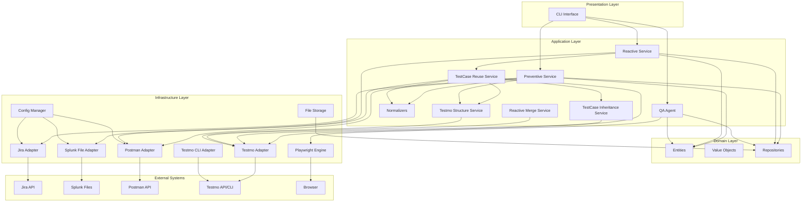

# Arquitetura do Sistema de QA Inteligente para PMS

## Visão Geral

O Sistema de QA Inteligente para PMS é uma solução baseada em implementações reais de empresas como Shopify, Spotify e Nubank. O sistema combina análise preventiva (antes da Sprint), análise reativa (em produção) e um agente assistente para QAs.

## Princípios Arquiteturais

### 1. Arquitetura Hexagonal (Ports & Adapters)

A arquitetura segue o padrão Hexagonal, separando a lógica de negócio (core) das integrações externas (adapters):

- **Core (Domain)**: Entidades, Value Objects e regras de negócio
- **Application**: Serviços de aplicação e casos de uso
- **Infrastructure**: Adaptadores para sistemas externos (Jira, Splunk, Postman)
- **Presentation**: Interfaces de usuário (CLI inicialmente)

### 2. Separação de Responsabilidades

- **Preventive Service**: Análise de tickets antes da Sprint
- **Reactive Service**: Análise de logs em produção
- **QA Agent**: Assistente que grava ações e sugere testes

### 3. Foco em Estabilidade

- Uso de APIs diretas e estáveis (não MCPs experimentais)
- Tecnologias comprovadas em produção
- Arquitetura preparada para evoluir sem quebrar

## Diagrama de Componentes



## Camadas da Arquitetura

### Domain Layer

**Responsabilidade**: Contém a lógica de negócio pura, independente de frameworks ou tecnologias externas.

**Componentes**:
- **Entities**: Ticket, TestCase, LogPattern
- **Value Objects**: RiskLevel, TestPriority
- **Repositories**: Interfaces para persistência

**Características**:
- Sem dependências externas
- Regras de negócio puras
- Testável isoladamente

### Application Layer

**Responsabilidade**: Orquestra o fluxo de trabalho e coordena os adapters.

**Componentes**:
- **Preventive Service**: Analisa tickets e gera ACs
- **Reactive Service**: Analisa logs e identifica padrões
- **QA Agent**: Grava ações e sugere testes
- **TestCaseReuseService**: Reuso e sincronização de test cases entre Postman e Testmo
- **TestCaseInheritanceService**: Herança de casos do Base para Reativo
- **ReactiveMergeService**: Merge de casos reativos ao final da sprint
- **TestmoStructureService**: Gerenciamento de estrutura de pastas no Testmo

**Serviços Compartilhados**:
- **ComponentNormalizer**: Normalização de nomes de componentes
- **EndpointNormalizer**: Normalização de paths de endpoints
- **TestCaseNameGenerator**: Geração de nomes seguindo convenções
- **NameParser**: Parser e validador de nomes

**Características**:
- Usa adapters para comunicação externa
- Contém lógica de aplicação (não de negócio)
- Coordena múltiplos adapters
- Normalização automática para consistência
- Herança e reuso para eficiência

### Infrastructure Layer

**Responsabilidade**: Implementa integrações com sistemas externos.

**Componentes**:
- **Adapters**: Jira, Splunk, Postman, Playwright
- **Config**: Gerenciamento de configurações
- **Persistence**: Armazenamento de dados

**Características**:
- Isolamento de detalhes de implementação
- Fácil substituição de implementações
- Tratamento de erros de integração

### Presentation Layer

**Responsabilidade**: Interface com o usuário.

**Componentes**:
- **CLI**: Interface de linha de comando

**Características**:
- Simples e direta
- Pode evoluir para web UI no futuro
- Não contém lógica de negócio

## Fluxos de Dados Principais

### Fluxo Preventivo

```
Jira → Jira Adapter → Preventive Service → AC Generator → Postman Adapter → Postman Collection
```

### Fluxo Reativo

```
Splunk → Splunk Adapter → Reactive Service → Pattern Matcher → Alert Manager → Notificações
```

### Fluxo QA Agent

```
Browser → Playwright Engine → QA Recorder → Test Suggester → Playwright Script
```

## Padrões de Design Utilizados

### 1. Repository Pattern

Abstrai a persistência de dados, permitindo trocar implementações sem afetar a lógica de negócio.

### 2. Adapter Pattern

Isola integrações externas, facilitando testes e manutenção.

### 3. Service Layer Pattern

Organiza lógica de aplicação em serviços coesos.

### 4. Value Object Pattern

Representa conceitos imutáveis do domínio (RiskLevel, TestPriority).

## Decisões de Arquitetura

### Por que Arquitetura Hexagonal?

- **Testabilidade**: Facilita testes isolados
- **Manutenibilidade**: Separação clara de responsabilidades
- **Flexibilidade**: Fácil adicionar novas integrações
- **Independência**: Core não depende de frameworks

### Por que Python Puro?

- **Simplicidade**: Sem over-engineering inicial
- **Produtividade**: Desenvolvimento rápido
- **Ecossistema**: Bibliotecas maduras disponíveis
- **Manutenibilidade**: Código fácil de entender

### Por que APIs Diretas (não MCPs)?

- **Estabilidade**: APIs mudam raramente
- **Documentação**: Bem documentadas e suportadas
- **Produção**: Usadas por empresas grandes
- **ROI**: Menor complexidade, maior confiabilidade

## Escalabilidade

A arquitetura está preparada para crescer:

1. **Novos Adapters**: Fácil adicionar novas integrações
2. **Novos Services**: Estrutura permite novos serviços
3. **Distribuição**: Pode evoluir para microserviços se necessário
4. **Performance**: Cache e otimizações podem ser adicionadas

## Segurança

- Credenciais em arquivos de configuração separados
- Não armazenar dados sensíveis em código
- Validação de inputs em todas as camadas
- Logs sem informações sensíveis

## Observabilidade

- Logs estruturados em todas as camadas
- Métricas de execução
- Tratamento de erros centralizado
- Rastreamento de execuções

## Próximos Passos

1. Implementar Domain Models
2. Implementar Adapters básicos
3. Implementar Services MVP
4. Criar testes de integração
5. Documentar APIs internas

