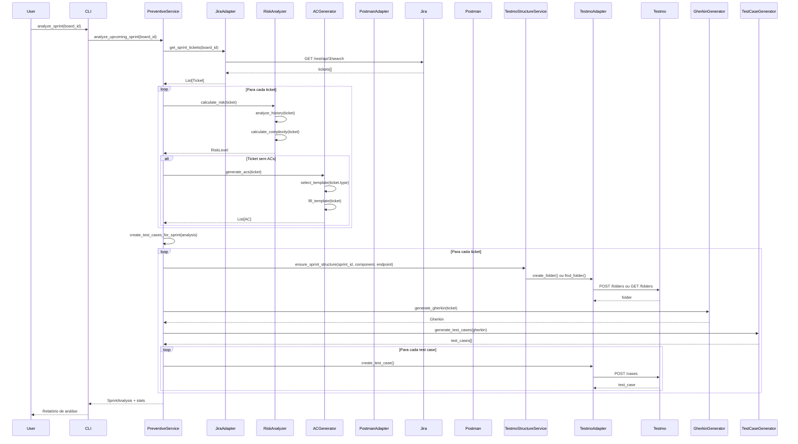
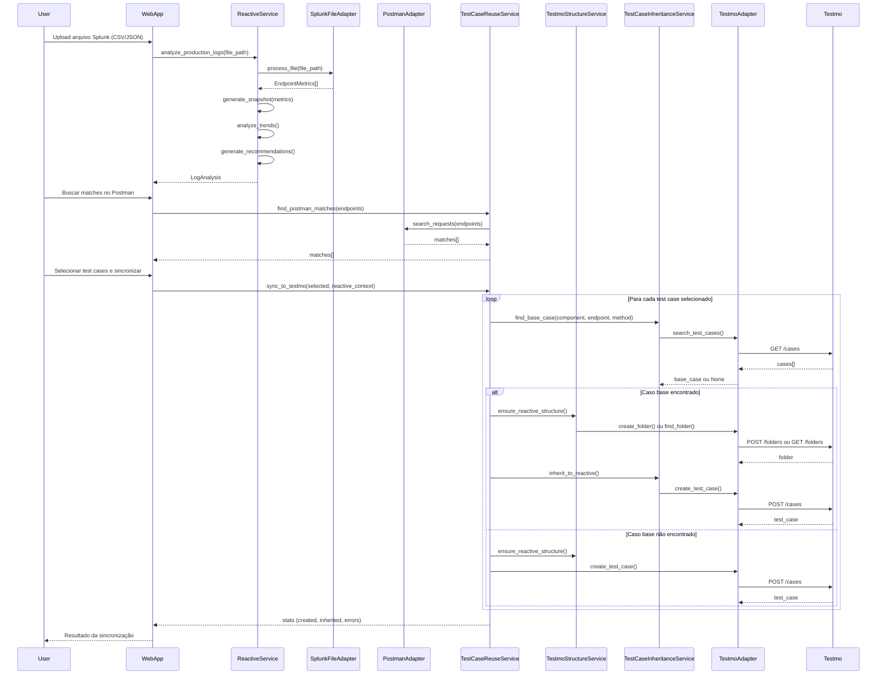
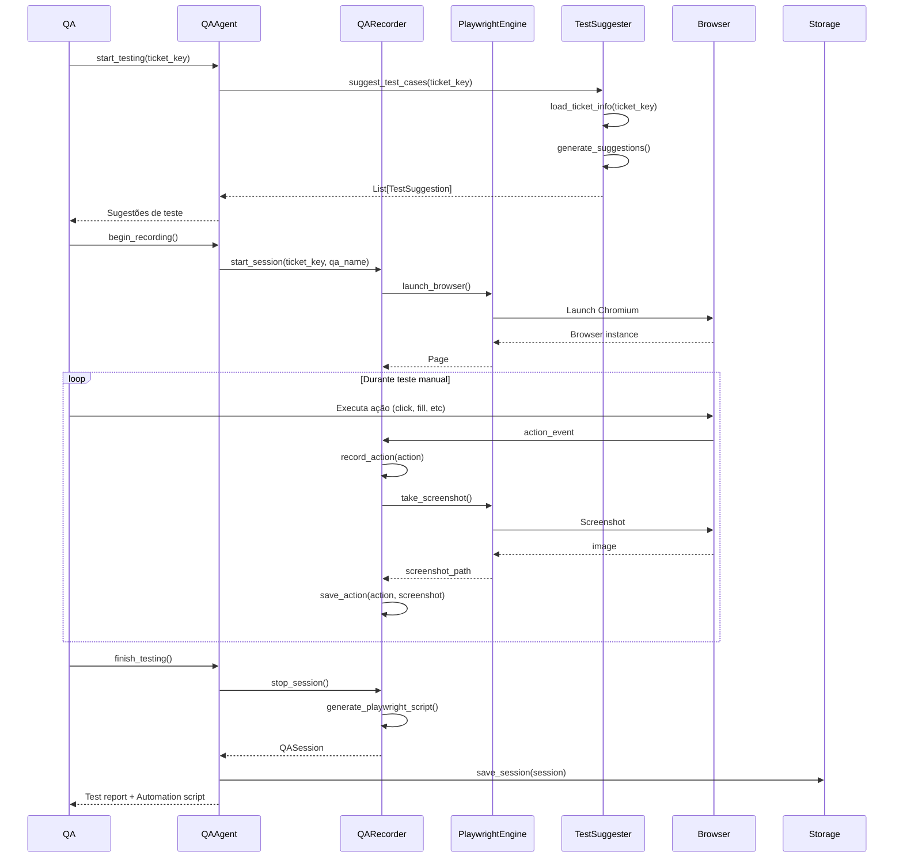
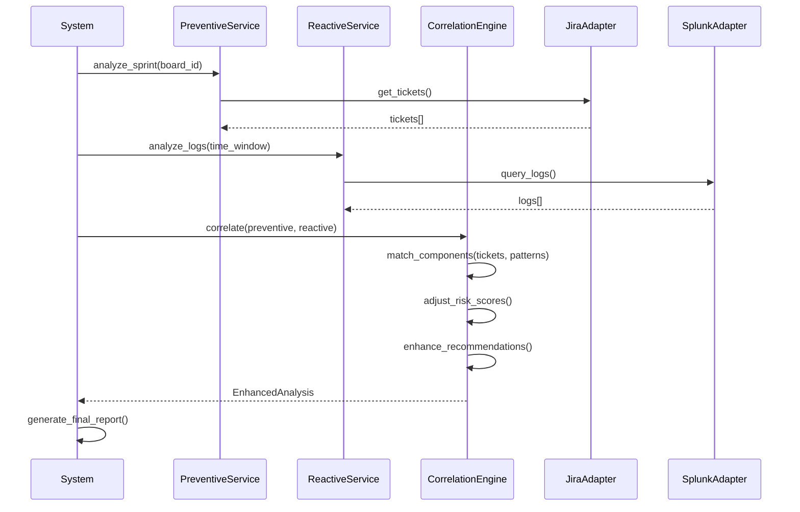
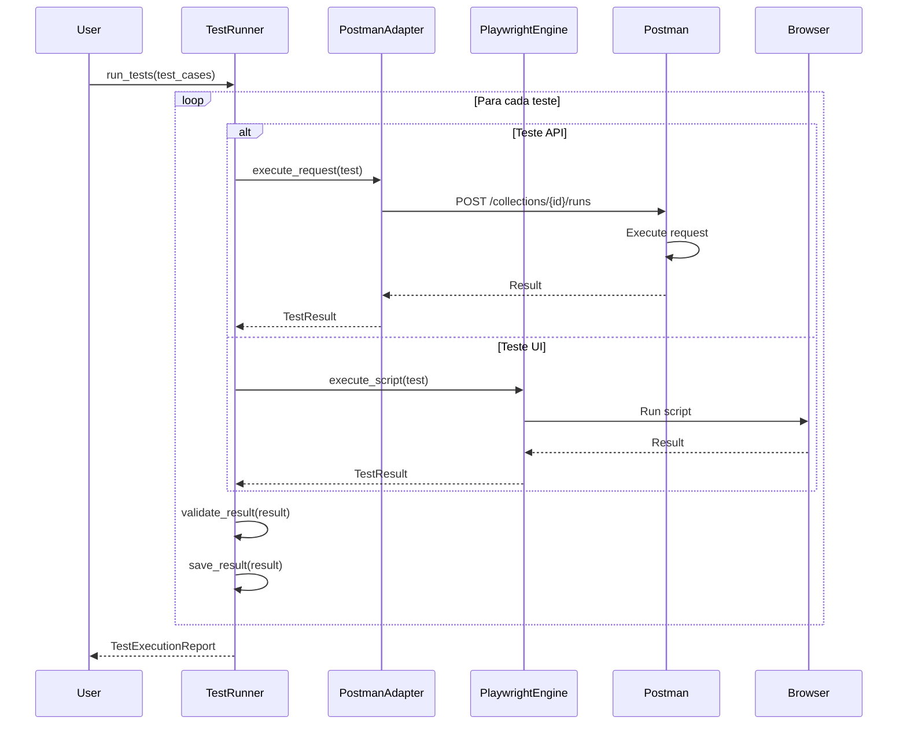
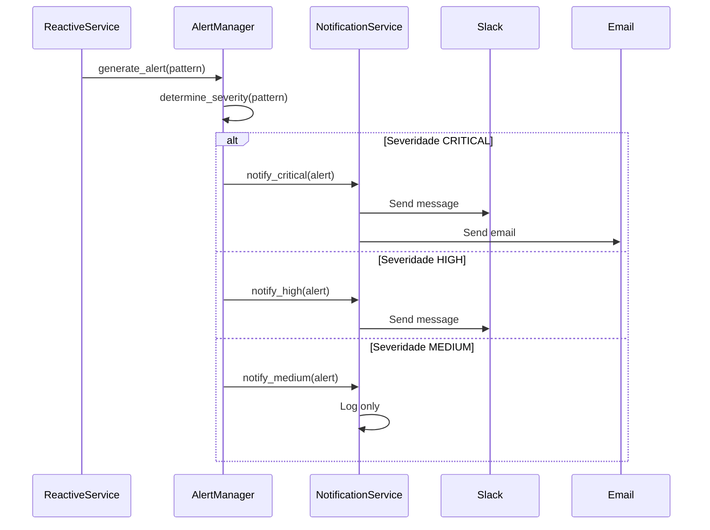

# Fluxos de Trabalho

Este documento descreve os fluxos de trabalho principais do sistema, incluindo diagramas de sequência detalhados.

## Fluxo Preventivo

O fluxo preventivo analisa tickets antes da Sprint começar, gerando ACs, estratégias de teste e criando test cases no Testmo organizados por sprint e componente.

### Diagrama de Sequência



### Passos Detalhados

1. **Início**: Usuário executa comando para analisar Sprint
2. **Busca Tickets**: Sistema busca todos os tickets da Sprint no Jira
3. **Análise de Risco**: Para cada ticket:
   - Analisa histórico de bugs do componente
   - Calcula complexidade baseada em descrição e tipo
   - Determina nível de risco
4. **Geração de ACs**: Para tickets sem ACs:
   - Seleciona template baseado no tipo de ticket
   - Preenche template com informações do ticket
   - Gera ACs sugeridos
5. **Normalização**: Normaliza componentes e endpoints
6. **Criação de Estrutura**: Cria estrutura no Testmo:
   - `Sprint-{ID}/{Component}/{METHOD}_{Endpoint}/`
7. **Geração de Test Cases**: Para cada ticket:
   - Converte para Gherkin
   - Gera test cases estruturados
   - Cria no Testmo com nome: `{TICKET_KEY}_{METHOD}_{TestType}_{Description}`
8. **Retorno**: Retorna análise completa com recomendações e estatísticas de criação

### Exemplo de Uso

```python
from src.application.preventivo import PreventiveService

service = PreventiveService()
analysis = service.analyze_upcoming_sprint("PMS-123")

print(f"Risco geral: {analysis.risk_assessment.overall_risk}")
print(f"Tickets de alto risco: {len(analysis.risk_assessment.high_risk_tickets)}")
print(f"Testes sugeridos: {analysis.test_strategy.total_tests_suggested}")
```

## Fluxo Reativo

O fluxo reativo analisa logs em produção para identificar padrões, gerar alertas e criar test cases no Testmo com estrutura organizada.

### Diagrama de Sequência



### Passos Detalhados

1. **Upload de Arquivo**: Usuário faz upload de arquivo CSV/JSON exportado do Splunk
2. **Processamento**: Sistema processa arquivo e extrai métricas de endpoints
3. **Análise de Tendências**: Compara com snapshots anteriores (se existirem)
4. **Geração de Recomendações**: Identifica endpoints prioritários para teste
5. **Busca no Postman**: Busca endpoints correspondentes no Postman
6. **Sugestão de Test Cases**: Prepara sugestões com informações do Postman
7. **Verificação no Testmo**: Verifica se test cases já existem
8. **Herança de Casos**: Busca casos similares no Base para herdar
9. **Criação no Testmo**: Cria test cases no repositório Reativo:
   - Estrutura: `Reativo/{Date}_{Priority}_{Trend}/{Endpoint}/`
   - Casos herdados ou novos
   - Links para casos base (se herdados)
10. **Armazenamento**: Salva análise e snapshot para histórico
11. **Merge ao Final da Sprint**: Migra casos úteis para Base e deleta pasta reativa

### Exemplo de Uso

```python
from src.application.reativo import ReactiveService
from datetime import timedelta

service = ReactiveService()
time_window = timedelta(hours=24)
analysis = service.analyze_production_logs(time_window)

print(f"Padrões identificados: {len(analysis.patterns)}")
print(f"Alertas gerados: {len(analysis.alerts)}")
for alert in analysis.alerts:
    print(f"  - {alert.title}: {alert.severity}")
```

## Fluxo QA Agent

O fluxo do QA Agent grava ações do QA durante testes e gera automação.

### Diagrama de Sequência



### Passos Detalhados

1. **Início**: QA inicia sessão de teste para um ticket
2. **Sugestões**: Sistema sugere casos de teste baseados no ticket
3. **Gravação**: QA executa testes manualmente enquanto sistema grava:
   - Todas as ações (cliques, preenchimentos, navegações)
   - Screenshots após cada ação importante
   - URLs visitadas
   - Elementos interagidos
4. **Geração de Script**: Ao finalizar:
   - Converte ações gravadas em script Playwright
   - Identifica seletores dos elementos
   - Cria validações básicas
5. **Armazenamento**: Salva sessão completa
6. **Retorno**: Retorna relatório e script de automação

### Exemplo de Uso

```python
from src.application.agent import QAAgent

agent = QAAgent()
session = agent.assist_qa_testing("PMS-456")

print(f"Sessão gravada: {session.session_id}")
print(f"Ações gravadas: {len(session.actions)}")
print(f"Script gerado: {session.automation_script is not None}")
```

## Fluxo Integrado (Preventivo + Reativo)

O sistema pode combinar análise preventiva e reativa para melhorar predições.

### Diagrama de Sequência



### Benefícios da Integração

1. **Risco Mais Preciso**: Usa dados de produção para ajustar risco de tickets
2. **Testes Mais Relevantes**: Sugere testes baseados em problemas reais
3. **Priorização Melhor**: Foca em componentes com histórico de problemas
4. **Prevenção Real**: Evita problemas conhecidos antes de acontecerem

## Fluxo de Execução de Testes

Fluxo para executar testes gerados automaticamente.

### Diagrama de Sequência



## Fluxo de Notificações

Fluxo para enviar notificações quando alertas são gerados.

### Diagrama de Sequência



## Considerações de Implementação

### Tratamento de Erros

Todos os fluxos devem tratar erros graciosamente:
- Logs detalhados de erros
- Retry para falhas temporárias
- Fallback para operações críticas
- Notificações de falhas

### Performance

- Queries ao Splunk devem ter timeout
- Cache de resultados quando possível
- Processamento assíncrono para operações longas
- Limites de paginação para grandes volumes

### Detecção de Anomalias (Story 31.9)

O sistema detecta automaticamente anomalias durante a execução de workflows.

**Fluxo de Detecção:**
1. Após workflow completion, sistema carrega baseline histórico (últimas 30 execuções)
2. Calcula métricas estatísticas (média, desvio padrão) para execution time
3. Compara execução atual com baseline usando z-score
4. Detecta anomalias se:
   - Performance degradation: execution time > baseline + 2σ
   - Unusual execution time: |z-score| > 2.0
5. Gera alertas se anomalias forem detectadas
6. Armazena anomalias no banco de dados para análise posterior

**Tipos de Anomalias:**
- `PerformanceDegradation`: Tempo de execução significativamente acima do baseline
- `UnusualExecutionTime`: Tempo de execução incomum (muito rápido ou muito lento)

**Severidade:**
- `Info`: Z-score entre 2.0 e 2.5
- `Warning`: Z-score entre 2.5 e 3.0
- `Critical`: Z-score > 3.0

**Integração:**
- Detecção automática no evento `complete_workflow`
- Executado em background (non-blocking)
- Alertas enviados via sistema de alertas com rate limiting
- Dashboard UI disponível em `/anomalies`

### Segurança

- Credenciais nunca em logs
- Validação de inputs em todas as camadas
- Sanitização de dados antes de armazenar
- Auditoria de ações sensíveis

