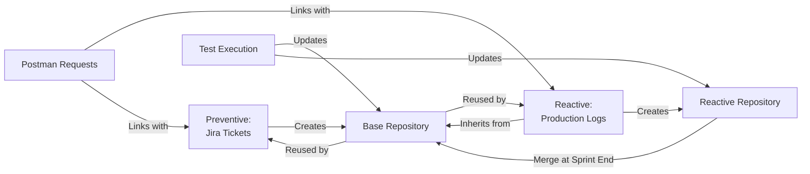
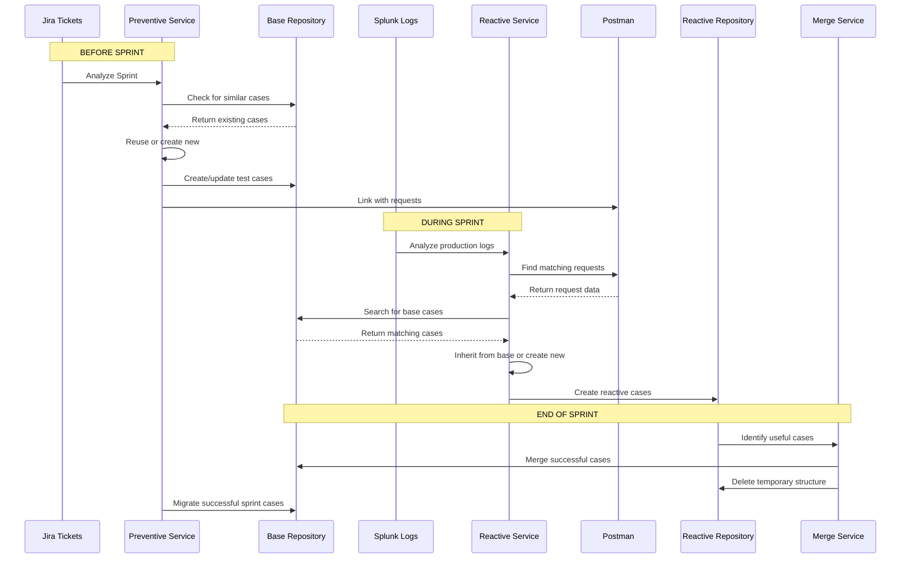

# QA Intelligent PMS - Project Concept

## Project Concept: Test Case Lifecycle Management

### Core Philosophy

**Primary Goal**: Increase QA efficiency by automating repetitive tasks, allowing QAs to focus on strategic thinking, process improvement, and overall product quality enhancement.

This system implements a **complete test case lifecycle** that continuously evolves test cases through three complementary strategies:

1. **Preventive Strategy**: Creates test cases BEFORE code reaches production (from Jira tickets)
2. **Reactive Strategy**: Creates test cases based on REAL production problems (from Splunk logs)
3. **Repository Evolution**: Test cases flow between repositories, improving over time

**QA Empowerment**: The system provides a **built-in TODO/checklist interface** that guides QAs through all workflow steps. QAs maintain full control at every stage - they can choose to use automation scripts or perform tasks manually, enabling them to take control whenever needed. This approach respects QA expertise while reducing time spent on routine operations.

### The Test Case Lifecycle



### Two Complementary Testing Strategies

#### 1. Preventive Strategy (Before Sprint)

**When to use**: Before sprint starts, analyzing upcoming work

**Why use it**: 
- Prevents bugs BEFORE they reach production
- Creates test cases based on planned requirements (Jira tickets)
- Identifies high-risk tickets before development starts
- Generates Acceptance Criteria for tickets missing them

**How it works**:
- Analyzes Jira tickets for upcoming sprint
- Calculates risk scores based on component history and ticket complexity
- Generates ACs using templates
- Creates test cases organized by sprint: `Sprint-{ID}/{Component}/{Endpoint}/`
- **Reuses existing test cases from Base repository** when similar cases exist
- Updates Base repository with new test cases that become reusable knowledge

**Flow**:
```
Jira Tickets → Risk Analysis → AC Generation → Test Case Generation → 
Check Base Repository (reuse if exists) → Create in Sprint Structure → 
Update Base Repository with new cases
```

#### 2. Reactive Strategy (In Production)

**When to use**: When problems already exist in production (logs, errors, metrics)

**Why use it**:
- Identifies REAL problems that are actually happening
- Focuses testing efforts on endpoints with actual issues
- Creates test cases based on production metrics (error rates, traffic patterns)
- Detects trends and degradation over time

**How it works**:
- Analyzes Splunk logs (CSV/JSON exports)
- Identifies critical endpoints (high error rates, high traffic, degrading trends)
- **Reuses existing test cases from Base repository** via inheritance
- Links with Postman to get actual request details (bodies, headers, CURL)
- Creates test cases in Reactive repository: `Reativo/{Date}_{Priority}_{Trend}/`
- At sprint end: merges useful cases back to Base, deletes temporary reactive structure

**Flow**:
```
Splunk Logs → Metrics Analysis → Critical Endpoint Identification → 
Search Postman for Requests → Check Base Repository (inherit if exists) → 
Create in Reactive Structure → Link with Base cases → 
Sprint End: Merge useful cases to Base
```

### Why Naming Conventions Are Critical

**Problem solved**: Test case names must be both human-readable AND machine-processable

**Format**: `{METHOD}_{TestType}_{Description}`

**Examples**:
- `POST_CreateQuote_ValidRequest`
- `GET_GetQuote_NotFound`

**Why this matters**:

1. **Machine Processing**: Regex patterns enable automated searching, grouping, parsing
   - Find all POST tests: `/^POST_/`
   - Extract method, type, description automatically
   - Validate format before creation

2. **Human Understanding**: Developers/QAs instantly understand what the test does
   - Method: POST (creates something)
   - Type: CreateQuote (what it creates)
   - Description: ValidRequest (test scenario)

3. **Repository Organization**: Enables structured folder hierarchy
   - Base: `Base/{Component}/POST_api-v3-quotes/POST_CreateQuote_ValidRequest`
   - Reactive: `Reativo/{Date}_{Priority}/POST_api-v3-quotes/POST_api-v3-quotes_Critical_2025-01-15`

4. **Lifecycle Management**: Names can be processed to:
   - Identify similar cases for reuse
   - Extract metadata (method, endpoint, component)
   - Track inheritance relationships
   - Merge cases intelligently

### Why Link Postman with Testmo

**Concept**: Bridge the gap between development tools (Postman) and QA tools (Testmo)

**The Problem**:
- Developers create and test API requests in Postman
- QA needs to create formal test cases in Testmo
- Duplicating work manually is error-prone and time-consuming

**The Solution**: Automatic linking and synchronization

**How it works**:

1. **Reactive Flow**:
   - System identifies critical endpoint from Splunk logs
   - Searches Postman for matching request
   - Extracts real request data: body, headers, authentication, CURL command
   - Creates Testmo test case with actual Postman data
   - **Ensures test cases use the same requests developers validated**

2. **Preventive Flow**:
   - System generates test cases from Jira tickets
   - Can search Postman for related requests
   - Links test case to Postman collection/request
   - Enables execution directly from Postman

3. **Bidirectional Sync**:
   - Changes in Postman can update Testmo test cases
   - Test cases in Testmo reference Postman requests
   - Execution results can be submitted to Testmo via CLI

**Value Delivered**:
- **Reuse real requests**: No manual copying of bodies/headers
- **Synchronization**: Changes in Postman reflected in Testmo
- **Accuracy**: Test cases use exactly what developers tested
- **Automation**: Create test cases automatically from Postman data

### Test Case Reuse Across Strategies

#### How Preventive Can Reuse Base Repository

**Current Status**: Planned feature (not yet implemented)

**Concept**:
1. When generating test cases from Jira tickets
2. System searches Base repository for similar cases
3. If similar case exists:
   - Reuse structure (steps, expected results)
   - Adapt for new ticket context
   - Create new case linked to original
4. If no similar case:
   - Create new case from scratch
   - Add to Base repository for future reuse

**Benefits**:
- Avoids duplicating test cases for similar functionality
- Builds on existing knowledge
- Ensures consistency across sprints
- Base repository grows with each sprint

#### How Reactive Can Reuse Base Repository

**Current Status**: Implemented (inheritance system)

**How it works**:
1. System identifies critical endpoint from logs
2. Searches Base repository for matching endpoint/method
3. If base case found:
   - **Inherits** steps and structure from base
   - Adds reactive context (priority, date, error metrics)
   - Creates link between reactive and base cases
4. If no base case:
   - Creates new case
   - Can be merged to Base at sprint end if useful

**Inheritance Example**:
- Base case: `POST_CreateQuote_ValidRequest` (standard steps)
- Reactive case: `POST_api-v3-quotes_Critical_2025-01-15` (inherits steps, adds context)

#### How Preventive Cases Update Base Repository

**Concept**: Test cases created during sprint planning become reusable knowledge

**Flow**:
1. Preventive analysis creates test cases in sprint structure
2. After sprint execution, successful/tested cases are evaluated
3. Cases that are:
   - Unique (no equivalent in Base)
   - Improved (better than existing in Base)
   - Successful (executed with high success rate)
4. Are migrated to Base repository
5. Base repository becomes a knowledge base that improves over time

**Example**:
- Sprint 123 creates: `Sprint-123/Booking/POST_api-v3-quotes/PMS-456_POST_CreateQuote_ValidRequest`
- After sprint: Case executed successfully, no equivalent in Base
- Migration: Moves to `Base/Booking/POST_api-v3-quotes/POST_CreateQuote_ValidRequest`
- Future sprints: Can reuse this case

### Complete Lifecycle Flow



### QA Empowerment & Control

**Concept**: While automation handles repetitive tasks, QAs maintain full control and visibility over the entire workflow.

**Built-in TODO/Checklist System**:
- Integrated task management within the web application
- Step-by-step guidance for all workflows (preventive and reactive)
- Clear visibility of current status and next actions
- Common TODO app patterns (check/uncheck, progress tracking, filtering)
- Tasks automatically populated based on workflow context

**Optional Automation with Manual Override**:
- QAs can choose to run automation scripts or perform tasks manually
- Toggle automation on/off at any step in the workflow
- Manual execution options always available alongside automated ones
- Full control to review, modify, or bypass automated decisions
- Freedom to take manual control at any moment

**Value Delivered**:
- **Efficiency**: Automation handles routine work, freeing QA time
- **Strategic Focus**: More time for thinking about better strategies and processes
- **Quality Improvement**: Focus on overall product quality rather than repetitive tasks
- **Control**: Never locked into automation - manual override always available
- **Guidance**: Clear checklist ensures nothing is missed while maintaining flexibility

**Example Workflow**:
1. System suggests: "Analyze Splunk logs for critical endpoints"
2. QA chooses: Run automated analysis OR upload and analyze manually
3. System suggests: "Create test cases in Testmo"
4. QA chooses: Use automation script OR create manually via UI
5. TODO list updates automatically showing completed and pending tasks
6. QA can always switch between automated and manual modes

### Key Architectural Principles

1. **Repository Evolution**: Base repository grows and improves over time
2. **Reuse First**: Always check for existing cases before creating new ones
3. **QA Empowerment**: Automation is optional - QAs maintain full control
4. **Lifecycle Automation**: Minimize manual intervention while preserving flexibility
5. **Naming Standards**: Machine-processable names enable automation
6. **Integration Bridges**: Postman ↔ Testmo linking eliminates duplication
7. **Data-Driven**: Production data drives reactive strategy
8. **Risk-Based**: Preventive strategy focuses on high-risk areas
9. **Efficiency Through Guidance**: TODO system guides without constraining

## Related Documentation

- [Workflows](04-workflows.md) - Detailed workflow diagrams
- [Testmo Strategy](TESTMO-ESTRATEGIA-COMPLETA.md) - Complete Testmo integration strategy
- [Naming Structure](TESTMO-NOMENCLATURA-ESTRUTURA.md) - Naming conventions and repository structure
- [Roadmap 2026](ROADMAP-2026.md) - Complete 2026 development roadmap
